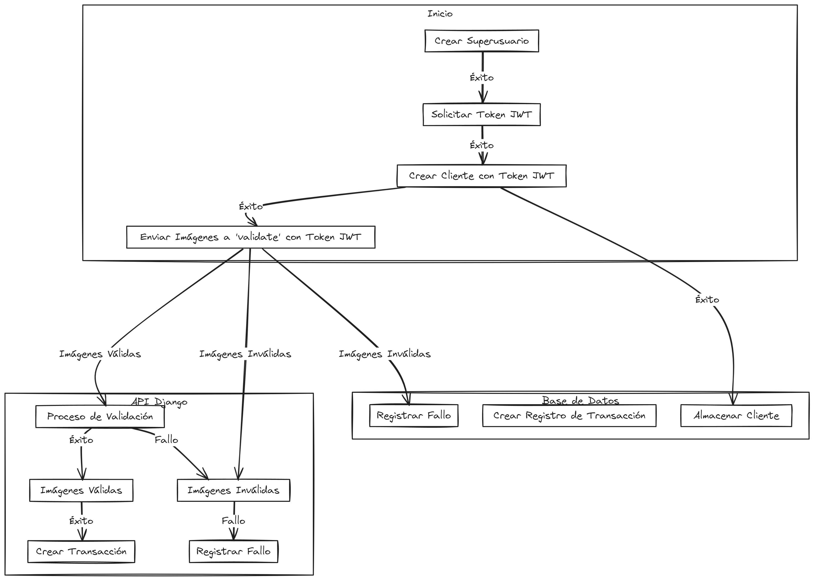

# Doc Validate 📋

## Overview 🌐

This project is a Django application with a focus on RESTful API design using Django REST Framework. It includes robust features for client and transaction management, along with utility functions for image processing. The project is containerized using Docker 🐳, and includes a Makefile for automation of common tasks.

## Project Components 🛠️

### ViewSets 🖥️

#### Clients 👥

- **ClientListCreateView**: Handles listing and creating clients. Uses ClientSerializer for data serialization and requires authentication.
- **ClientDetailView**: Manages retrieving, updating, and deleting clients. Uses ClientCreateSerializer for POST requests and ClientSerializer for other requests. This viewset allows any type of user to interact with it.

#### Transactions 💰

- **TransactionListCreateView**: Responsible for listing and creating transactions. It employs TransactionSerializer for handling data and requires authentication.
- **TransactionDetailView**: Deals with retrieving, updating, and deleting transactions. Similar to ClientDetailView, it uses a specific serializer for POST requests and another for the rest.

### Serializers 🧵

- **ClientSerializer** and **ClientCreateSerializer**: Handle serialization and deserialization of client data.
- **TransactionSerializer** and **TransactionCreateSerializer**: Used for transaction data serialization and deserialization.

### URLs 🌐

- **Client and Transaction URLs**: Define the API endpoints for client and transaction operations. These URLs map to the respective viewsets, facilitating RESTful operations like GET, POST, PUT, DELETE.
- **Documentation URLs**: Access the API documentation through the following URLs:
    - Redoc: /redoc 📕
    - Swagger: /swagger 📘

### Utils 🛠️

- **processing_images.py**: Contains utility functions or classes for image processing tasks. This can be crucial for handling media within the application.

### Makefile 🤖

Simplifies task execution like building, running, and cleaning up Docker containers, database migrations, creating superuser, and starting the application. For example, `make start` builds and starts the application.

## Docker Compose 🐳

Defines the application's services, including the main API service and a PostgreSQL database.

- Service 'api' is built from the Dockerfile and maps the application's port to the host.
- Service 'db' uses the official PostgreSQL image, with a volume for data persistence and environment configurations from dev.env.

## Documentation 📖

The project includes documentation in Redoc 📕 and Swagger 📘. You can access the documentation through the following URLs:

- Redoc: /redoc 📕
- Swagger: /swagger 📘

And diagram the project:

https://dbdiagram.io/d/6595b5fdac844320ae30f63e

## Tools 🧰

The project is named DocValidate and utilizes the following tools:

- Poetry 📦: A dependency management and packaging tool for Python projects.
- Debugpy 🐛: A debugger for Python that can be used locally.
- Makefile 🤖: A tool for simplifying tasks such as building, running, and cleaning up Docker containers.

## Installation & Setup 🛠️

´´´bash
Make start
´´´
and coffee ☕.

## Usage 🚀

### API 🌐

The API is available at http://localhost:8000/swagger/ 📘. or http://localhost:8000/redoc/

## Makefile for Dockerized Django with Poetry 🐍

The Makefile provides the following targets:

- **build**: Builds the Docker containers.
- **up**: Starts the Docker containers.
- **down**: Stops and removes the Docker containers.
- **clean**: Stops and removes the Docker containers, including volumes and orphaned containers.
- **migrations**: Runs database migrations.
- **superuser**: Creates a superuser with the username 'admin' and email 'admin@example.com'.
- **start**: Builds and starts the application.
- **create-app**: Creates a new Django app.

To use these targets, navigate to the project directory and run `make <target>`. For example, to start the application, run `make start` 🚀.
